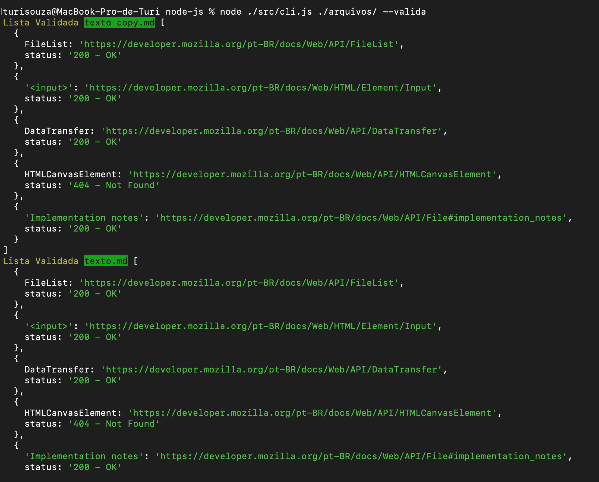
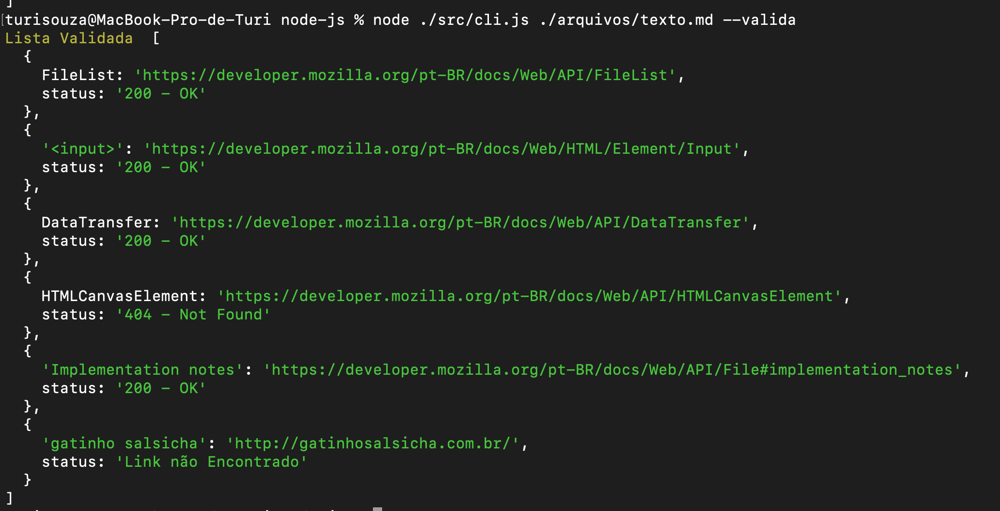

Projeto do curso de Criação de Bibliotecas da Alura

O objetivo desta biblioteca é testar em um arquivo .md ou em uma pasta onde tem arquivos .md se os links destes arquivos estão ativos.

Existem duas formas de utilizar. A primeira se você quiser validar vários arquivos de um diretório. Precisará usar o terminal com o seguinte código:

node ./src/cli.js caminhoDoDiretorio --valida

Como no exemplo:

E se você quiser utilizar para validar os links de um arquivo específico, deverá usar o seguinte código:

node ./src/cli.js caminhoDoDiretorioDoARquivo/nomeDoArquivo.md --valida

Como no exemplo:

